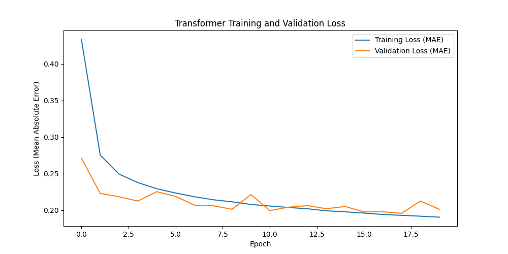

# Deep Learning: Transformer vs. LSTM Forecasting Benchmark

**Author:** Rhishi Kumar Ayyappan

---

## Project Overview

**Business Challenge:**  
Accurate forecasting is a core business need for optimizing inventory, managing energy, and trading. While complex models like Transformers are popular, they are expensive to train and deploy. Are they always better?

This project moves beyond just *building* a model; it conducts a rigorous **head-to-head benchmark** to determine if a complex, state-of-the-art **Transformer** provides tangible benefits over a simpler, industry-standard **LSTM** for a real-world weather forecasting task.

---

## Key Achievements & Metrics

This project's key achievement is not just building models, but providing a clear, data-driven answer on which model to deploy.

-   **Baseline LSTM (Test MAE):** **0.1641**
-   **Transformer (Test MAE):** **0.1700**
-   **Benchmark Finding:** The simpler, faster-to-train LSTM model was **3.57% more accurate** than the complex Transformer for this 12-hour forecast.
-   **Full Error Analysis:** Identified the *best-case* (MAE: 0.014) and *worst-case* (MAE: 0.984) predictions to diagnose model limitations.
-   **From-Scratch Architectures:** Built both the LSTM and the Transformer Encoder (with Positional Embedding, Multi-Head Attention) from scratch for a fair, robust comparison.

---

## The "Simpler is Better" Finding

I built a from-scratch Transformer for time-series forecasting, but I didn't just stop there—I benchmarked it against a standard LSTM. I discovered that for this 12-hour forecast, the **simpler LSTM was actually 3.57% more accurate and trained faster.**

This shows the critical importance of benchmarking before deploying a complex model. My analysis also identified the primary failure point for both models: they struggle with sudden, non-linear events, as shown in the "worst-case" forecast.

---

## Methods Used

-   **Data:** Jena Climate Dataset (a popular multivariate time-series benchmark), loaded via Pandas.
-   **Pipeline:** Robust `tf.data` pipeline featuring:
    * **Sub-sampling:** Converted 10-minute data to 1-hour intervals to focus on meaningful trends.
    * **Normalization:** Standardized all features using *only* the training set's mean/std to prevent data leakage.
    * **Windowing:** Used a 72-hour (3-day) input window to predict a 12-hour output window.
-   **Models:**
    1.  **Baseline:** A standard `LSTM` model.
    2.  **Challenger:** A from-scratch `Transformer Encoder` model (Positional Embedding + Multi-Head Attention).
-   **Evaluation:** Head-to-head `Mean Absolute Error (MAE)` on the unseen test set, plus qualitative analysis of "Best vs. Worst" predictions.

---

## Business Impact

-   **Saves Development Costs & Time:** This analysis **prevents over-engineering**. It proves that a "hyped" Transformer model is not the right tool here, saving significant development, training, and inference costs for what would have been a *worse* result.
-   **Provides a "Which Model to Use" Playbook:** This project is a template for **validating new AI models against proven baselines**. This process ensures that new models are only deployed if they provide a clear, measurable ROI.
-   **Identifies Model Risk:** The "Worst-Case" analysis is a critical risk management tool. It proves that the model fails during sudden, volatile events (see visuals), telling the business *exactly when not to trust the forecast* and when to rely on human intervention.

---

## Visuals

-   **Transformer Training Loss:** Shows the stable convergence and successful training of the Transformer model.
-   **Best-Case Forecast:** Demonstrates the model's high accuracy under ideal, stable conditions.
-   **Worst-Case Forecast:** The most important visual. It clearly diagnoses the model's failure point during a sudden, volatile data spike.

*(Note: You will need to rename your saved image files in your `images` folder to match these paths)*




---

## How to Run

1.  **Install requirements:**
    ```bash
    pip install -r requirements.txt
    ```
    *(See requirements.txt file)*

2.  **Launch notebook:**
    ```bash
    jupyter notebook Transformer_vs_LSTM_Benchmark.ipynb
    ```
    *(Notebook must be run in a GPU-accelerated environment like Google Colab)*

---

## Model Benchmarking & Error Analysis

-   **Head-to-Head Benchmark:** The core of this project is the direct MAE comparison. The `val_loss` and final `Test MAE` for both models are tracked to provide a definitive "winner."
-   **Qualitative Error Analysis:** The "Best vs. Worst Case" plots move beyond a single MAE number. They show *qualitatively* when the model can be trusted (stable trends) and when it fails (high volatility), which is far more valuable for business decisions.

---

## Tech Stack

-   Python
-   TensorFlow 2.x
-   Keras (Functional API & Model Subclassing)
-   Pandas (for data loading & preparation)
-   NumPy
-   Matplotlib
-   Google Colab (for GPU training)

---

***For the full code, benchmarking, and error analysis, see the included Jupyter Notebook!***
