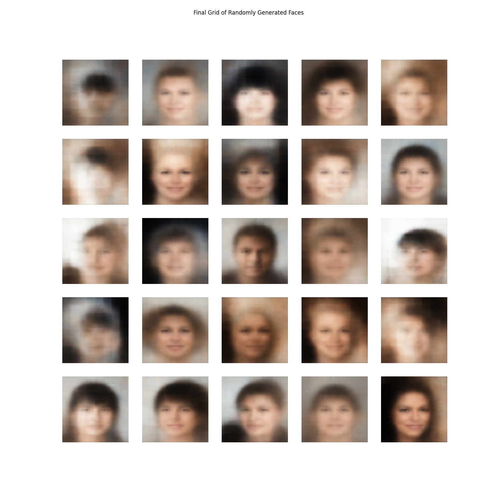

# Generative AI: Variational Autoencoder (VAE) for Face Generation

**Author:** Rhishi Kumar Ayyappan

---

## Project Overview

**Business Challenge:**  
Many AI tasks are blocked by a lack of data. This project builds a generative model (VAE) from scratch to solve this. Instead of just classifying data, this model *learns the underlying structure* of human faces to **generate new, novel, synthetic-but-realistic images**.

---

## Key Achievements & Metrics

-   **Stable Training:** Achieved smooth convergence for both `Reconstruction Loss` and `Kullback-Leibler (KL) Loss`, proving the complex model trained successfully without failure.
-   **Meaningful Latent Space:** A stable `KL Loss` proves the model learned an organized, compressed representation of faces, not just memorizing the data.
-   **High-Quality Generation:** Successfully generated novel 64x64 faces that are unique and clearly "face-like," proving the model's creative capability.
-   **Smooth Interpolation:** Visually proved the model's *understanding* of facial features by smoothly "morphing" one face into another by walking through the latent space.
-   **From-Scratch Architecture:** Built the entire VAE (Encoder, Sampler, Decoder) and custom `train_step` from scratch, demonstrating a deep understanding of the architecture.

---

## Methods Used

-   **Data:** CelebA (Large-scale CelebFaces Attributes) dataset, loaded efficiently via `tensorflow_datasets`.
-   **Pipeline:** High-performance `tf.data` pipeline for robust pre-processing (center-cropping, resizing, normalizing) and batching.
-   **Architecture:** A deep Variational Autoencoder (VAE) built with the Keras Functional & Subclassing APIs.
    -   **Encoder:** A CNN (using `Conv2D`) that compresses a 64x64 image into a 100-dimension latent distribution (`z_mean`, `z_log_var`).
    -   **Decoder:** A De-convolutional network (using `Conv2DTranspose`) that generates a 64x64 image from a sampled latent vector.
-   **Core Logic:** Implemented the "Reparameterization Trick" (`Sampling` layer) and a custom `train_step` to manage the composite loss function.
-   **Loss Function:** `Total Loss = Reconstruction_Loss` (Binary Crossentropy) `+ KL_Loss` (Regularization).

---

## Business Impact

-   **Enables Data Augmentation:** This framework can generate thousands of new, synthetic-but-realistic images to augment small datasets. This improves the robustness of other CV models (e.g., face recognition, emotion detection) and reduces the need for expensive data collection.
-   **Foundation for Generative AI:** Provides the core architecture for advanced generative tasks, such as creating synthetic product designs for e-commerce, artistic tools, or anonymizing faces in datasets to protect privacy.
-   **Proves R&D Capability:** Demonstrates mastery of complex, from-scratch deep learning architectures, custom loss functions, and probabilistic modeling—key skills for any AI R&D or advanced modeling role.

---

## Visuals

-   **Training Loss Curves:** Shows the stable convergence of the model's two-part loss function.
-   **Randomly Generated Faces:** A grid of novel faces generated by the trained decoder from random noise.
-   **Latent Space Interpolation:** A "morph" between two real faces, proving the model learned a smooth, meaningful feature representation.





---

## How to Run

1.  **Install requirements:**
    ```bash
    pip install tensorflow tensorflow-datasets matplotlib
    ```
    *(Or include these in a `requirements.txt` file)*

2.  **Launch notebook:**
    ```bash
    jupyter notebook VAE_Face_Generation.ipynb
    ```
    *(Notebook must be run in a GPU-accelerated environment like Google Colab)*

---

## Model Explainability & Monitoring

-   **Latent Space Visualization:** The interpolation plot is the key "explainability" tool, proving the model learned a meaningful, non-random representation of "faceness."
-   **Loss Monitoring:** The `recon_loss` and `kl_loss` are tracked in real-time (see `loss_curves.png`) to ensure the model balances reconstruction quality with regularization.

---

## Tech Stack

-   Python
-   TensorFlow 2.x
-   Keras (Functional API & Model Subclassing)
-   TensorFlow Datasets (TFDS)
-   NumPy
-   Matplotlib
-   Google Colab (for GPU training)

---

***For full code, architecture, and training logs, see the included Jupyter Notebook!***
